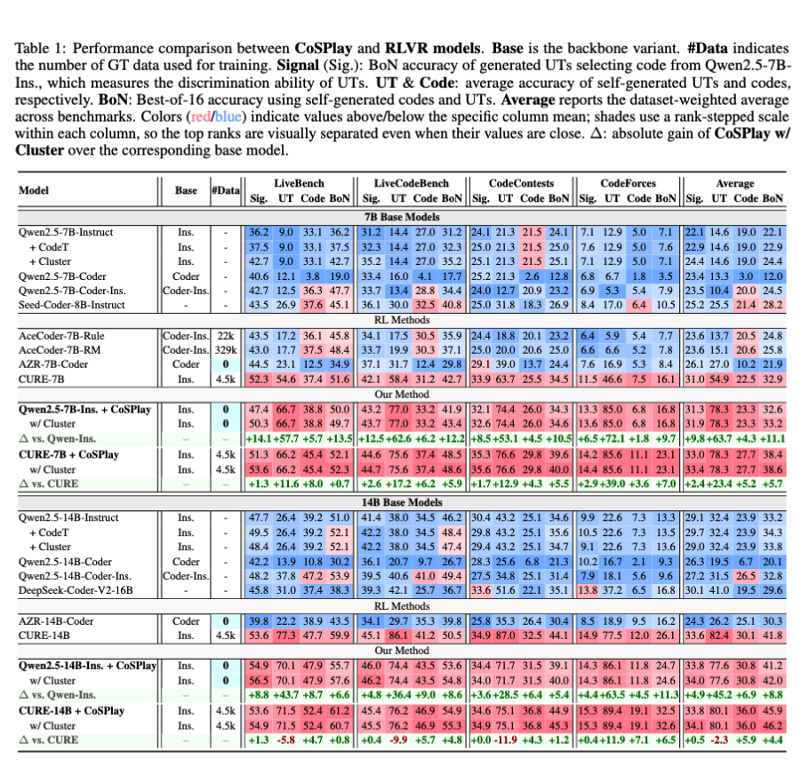

# CoSPlay: Cooperative Self-Play at Test-Time with Self-Generated Code and Unit Test

<p align="center">
  <a href="CoSPlay.pdf"></a>
  <a href="https://github.com/sanae-ai/CosPlay"></a>
  <a href="https://huggingface.co/datasets/yomi017/CosPlay"></a>
  <a href="LICENSE"></a>
</p>


<p align="center">
  📌 <a href="#-introduction">Introduction</a> •
  🎯 <a href="#-motivation">Motivation</a> •
  🧠 <a href="#-methods">Methods</a> •
  ✨ <a href="#-contributions">Contributions</a> •
  🚀 <a href="#-quick-start">Quick Start</a> •
  📊 <a href="#-interesting-results">Main Results</a> •
  📚 <a href="#-citation">Citation</a>
</p>


<p align="center">
  
</p>


<p align="center">
  <sub><em><strong>Capability Comparison.</strong> Performance comparison between our <b>Training-free</b> and <b>GT-free CoSPlay</b> and other RLVR methods need <b>costly weight updating</b> (AZR-7B-Coder 0k) or <b>massive GT labels</b> (AceCoder-7B-Rule 22k, AceCoder-7B-RM 329k, CURE-7B 4.5k).</em></sub>
</p>


## 📌 Introduction

Unit tests are powerful executable signals for code generation, but strong RLVR or GT-based TTS pipelines often rely on costly ground-truth tests, while GT-free methods struggle with noisy, weak, or spuriously coupled self-generated tests. **CoSPlay** is a **GT-free, training-free** framework that improves code and unit tests together at inference time through exploration-attack-guided idea generation, execution-matrix-driven self-play, and output-consensus clustering for final selection.

The current release provides evaluation code, benchmark loaders, paper figures, and scripts for reproducing the CoSPlay pipeline. Generated data and evaluation logs are hosted on Hugging Face.

## 🎯 Motivation

CoSPlay targets the middle ground between GT-dependent RLVR and sampling-only TTS: high-accuracy code generation with **no GT tests** and **no additional training**.

<p align="center">
  
</p>


<p align="center">
  <sub><em><strong>Motivation.</strong> GT-free and training-free code generation setting.</em></sub>
</p>


Existing RLVR methods can rely on costly ground-truth unit tests and weight updates, while GT-free TTS methods often spend more compute on sampling without reliably filtering noisy self-generated tests.

## 🧠 Methods

CoSPlay treats code generation as a test-time interaction between a code pool and a unit-test pool. The pipeline has three stages: idea-level exploration and attack, execution-matrix-driven self-play, and output-consensus cluster selection.

<p align="center">
  
</p>


<p align="center">
  <sub><em><strong>Full CoSPlay Pipeline.</strong> Exp&Atk idea generation, execution-matrix self-play, and output-consensus clustering.</em></sub>
</p>


CoSPlay first generates solution-oriented code ideas and failure-oriented UT ideas to bootstrap reliable and discriminative pools. It then co-evolves code and UTs through execution-matrix pass-count signals, and resolves BoN ties with output-consensus clustering.

## ✨ Contributions

- **GT-free and training-free self-play:** CoSPlay builds a cooperative loop between self-generated code and self-generated unit tests, improving inference-time performance without ground-truth unit tests or model weight updates.
- **Execution-matrix signals:** Code and unit-test pass counts provide internal reliability signals, allowing the method to clean weak code, refresh noisy tests, repair useful failures, and co-evolve both pools.
- **Consensus-based final selection:** Output-consensus clustering resolves BoN ties using random valid inputs, improving robustness, scaling behavior, and transfer across base models.

## 🚀 Quick Start

### ⚙️ Setup Environment

Clone the repository:

```bash
git clone https://github.com/sanae-ai/CosPlay.git
cd CosPlay
```

Create an environment and install dependencies:

```bash
bash setup_env.sh
```

The script initializes `conda` correctly for non-interactive bash, creates the `CosPlay` environment, and installs the CUDA-sensitive packages one step at a time. If your GPU, driver, or CUDA wheel stack differs from CUDA 12.8, override the relevant variables before running it, for example `TORCH_INDEX_URL`, `VLLM_WHEEL_URL`, `VLLM_EXTRA_INDEX_URL`, or `MAX_JOBS`.

### ⬇️ Download Dataset

We provide the benchmark datasets used by CoSPlay on Hugging Face. The download script writes JSON files to `CURE_data/`, which is where the evaluation scripts expect to find them.

#### Full Dataset Shards

Use the chunked Full Dataset benchmark files for normal reproduction and quick checks. You can browse them directly at [Datasets/CURE_data/Full_Dataset/chunked](https://huggingface.co/datasets/yomi017/CosPlay/tree/main/Datasets/CURE_data/Full_Dataset/chunked).

```bash
python data/download_data.py
```

List available Full Dataset chunks:

```bash
python data/download_data.py --list
```

Download selected files only, for example [LiveBench_chunk_0.json](https://huggingface.co/datasets/yomi017/CosPlay/blob/main/Datasets/CURE_data/Full_Dataset/chunked/LiveBench_chunk_0.json) and [CodeForces_chunk_0.json](https://huggingface.co/datasets/yomi017/CosPlay/blob/main/Datasets/CURE_data/Full_Dataset/chunked/CodeForces_chunk_0.json):

```bash
python data/download_data.py --dataset LiveBench_chunk_0 CodeForces_chunk_0
```

#### Complete Full Dataset

These are the four complete benchmark files:
[CodeContests.json](https://huggingface.co/datasets/yomi017/CosPlay/blob/main/Datasets/CURE_data/Full_Dataset/complete/CodeContests.json), [CodeForces.json](https://huggingface.co/datasets/yomi017/CosPlay/blob/main/Datasets/CURE_data/Full_Dataset/complete/CodeForces.json), [LiveBench.json](https://huggingface.co/datasets/yomi017/CosPlay/blob/main/Datasets/CURE_data/Full_Dataset/complete/LiveBench.json), and [LiveCodeBench.json](https://huggingface.co/datasets/yomi017/CosPlay/blob/main/Datasets/CURE_data/Full_Dataset/complete/LiveCodeBench.json). They are much larger than the chunked datasets, so download them only for full-dataset reprocessing.

```bash
python data/download_data.py --group full-dataset-complete
```

List available full benchmark files:

```bash
python data/download_data.py --group full-dataset-complete --list
```

#### Small Dataset

To reduce computational cost, experiments other than the main full-benchmark results use a 200-problem benchmark. For each random seed, we sample 50 problems from each of CodeContests, CodeForces, LiveBench, and LiveCodeBench, resulting in 200 problems in total. We use three random seeds to construct three independent 200-problem benchmarks and report the averaged results across them. These benchmark shards are separate from the Full Dataset files and live under [Datasets/CURE_data/Small_Dataset](https://huggingface.co/datasets/yomi017/CosPlay/tree/main/Datasets/CURE_data/Small_Dataset).

```bash
python data/download_data.py --group small-dataset
```

#### Temp Data

Generated outputs are under [temp_data](https://huggingface.co/datasets/yomi017/CosPlay/tree/main/temp_data), and evaluation logs are under [Logs](https://huggingface.co/datasets/yomi017/CosPlay/tree/main/Logs).


- [temp_data/main](https://huggingface.co/datasets/yomi017/CosPlay/tree/main/temp_data/main): main-table runs on the Full Dataset.
- [temp_data/generalization](https://huggingface.co/datasets/yomi017/CosPlay/tree/main/temp_data/generalization): Small Dataset transfer/generalization runs.
- [temp_data/scaling](https://huggingface.co/datasets/yomi017/CosPlay/tree/main/temp_data/scaling): candidate-budget scaling runs for `K_CODE = K_CASE in {2,4,8,16,32,64}` on the 7B setting. The `k=16` 7B run is also mirrored in `temp_data/tts` because it is the shared full CoSPlay reference.
- [Logs/tts](https://huggingface.co/datasets/yomi017/CosPlay/tree/main/Logs/tts): TTS ablations, including the full `k=16` 7B/14B CoSPlay and other tts method.

After downloading `temp_data`, you can recover the matrix-based metrics for any
CoSPlay temp-data split without regenerating model outputs or re-executing code.
The same matrix fields are used by `temp_data/main`, `temp_data/generalization`,
`temp_data/scaling`, and `temp_data/tts`: `test_bool_table` for pass@k,
`case_bool_table` for generated-UT BoN, and `new_bon_cluster_info["new_bon"]`
for the paper-facing output-consensus clustering metric. The helper writes
`per_file_metrics.csv`, `per_run_metrics.csv`, `per_setting_metrics.csv`, and
`metrics_summary.json`.

The command can be launched through the commented bash wrapper
[`evaluation/Temp_Data/temp_data.sh`](evaluation/Temp_Data/temp_data.sh):

```bash
export ROOT=/path/to/temp_data/tts       # temp_data root or JSON file
export KIND=round                        # round: saved self-play rounds
export ROUND_ID=05                       # self-play round id; leave empty to include all saved rounds
export OUT_DIR=outputs/round05_metrics   # output directory for CSV and JSON summaries
bash evaluation/Temp_Data/temp_data.sh
```

The `Logs/tts` baseline artifacts are separate from these CoSPlay temp-data
matrices. Those methods store selected code and tests in different formats, so
their README files describe the method-specific selected-code field and
evaluation wrapper.

### 🔥 Run

All evaluations use the same shell entrypoint. Configure the model, sampling
budget, self-play rounds, repeat IDs, and GPU placement through environment
variables before calling `evaluation/eval.sh`:

```bash
export CONDA_ENV_NAME=CosPlay            # conda environment name
export MODEL=Qwen/Qwen2.5-14B-Instruct   # Hugging Face model name
export K_CODE=16                         # number of code candidates
export K_CASE=16                         # number of generated test cases
export SELF_PLAY_ROUND=5                 # self-play refinement rounds
export EVAL_MODE=bon                     # evaluation mode
export REPEAT_IDS=1,2,3                  # repeated trial IDs
export CUDA_VISIBLE_DEVICES=0,1          # visible GPUs
export GPU_GROUPS='[[0],[1]]'            # GPU groups used by parallel workers
bash evaluation/eval.sh
```

Datasets are resolved as file stems under `CURE_data/`, for example `--dataset CodeContests_chunk_0` loads `CURE_data/CodeContests_chunk_0.json`.

### 📈 Signal

**Signal**: BoN accuracy of generated UTs selecting code from Qwen2.5-7B-Ins., which measures the discrimination ability of UTs. To reproduce the Signal analysis, use [`evaluation/Signal/signal.py`](evaluation/Signal/signal.py).
The script pairs a code-candidate directory (`--code_dir`) with a generated-UT directory (`--case_dir`), executes the generated UTs against the code pool, and recomputes BoN plus optional Cluster metrics. Both directories should contain matching chunked JSON files such as `..._chunk_0.json` and `..._chunk_1.json`.

```bash
# Example: CoSPlay-generated UTs on Qwen2.5-7B-Instruct code candidates.
CASE_DIR="temp_data/main/Cosplay-14b/Cosplay_CodeContests_14b_0/self_play_v2_rounds"
CODE_DIR="temp_data/main/Qwen2.5-7B-Ins/Qwen2_5_Instruct_CodeContests_7b_0"
OUT_DIR="outputs/signal"

python evaluation/Signal/signal.py \
  --case_dir "$CASE_DIR" \
  --code_dir "$CODE_DIR" \
  --out_dir "$OUT_DIR" \
  --outputs_prefix "CODE_Qwen2.5_Ins_UT_CoSPlay_round_05_CodeContests" \
  --mode "CODE_Qwen2.5_Ins_UT_CoSPlay_round_05_CodeContests" \
  --result_subdir "signal" \
  --strict \
  --k_code 16 \
  --k_case 16 \
  --case_contains "round_05" \
  --generation_mode exp-atk \
  --compute_cluster True
```

Use `--generation_mode exp-atk` for CoSPlay-generated UTs and `--generation_mode original_resample` for non-CoSPlay UT sources. Keep `--strict` enabled for final experiments so mismatched chunks or task IDs stop the run instead of being skipped silently. Set `--compute_cluster False` when only default BoN is needed.

## 📊 Main Results

<p align="center">
  
</p>

<p align="center">
  <sub><em><strong>Main Results.</strong> Performance comparison between CoSPlay and RLVR baselines.</em></sub>
</p>

**\#Data** is the amount of GT training data; **Sig.** measures generated-test selection accuracy; **UT** and **Code** are generated unit-test and code correctness; **BoN** is best-of-N accuracy using generated tests. Red/blue cells are above/below the column mean, and Δ rows report absolute gains over the corresponding base model.

---

<p align="center">
  
</p>

<p align="center">
  <sub><em><strong>Efficiency.</strong> Token cost versus Pass@1 on Qwen2.5-Instruct models.</em></sub>
</p>


Darker markers indicate scaled variants with larger budgets; CoSPlay reaches a stronger cost-accuracy trade-off than GT-free TTS baselines.

---

<p align="center">
  
</p>


<p align="center">
  <sub><em><strong>Generalization.</strong> BoN gains across base and RL models.</em></sub>
</p>


CoSPlay generalizes across different model families and scales, showing that the self-play mechanism is not tied to a single checkpoint.

---

<p align="center">
  
</p>


<p align="center">
  <sub><em><strong>Scaling.</strong> BoN accuracy versus candidate-pool budget.</em></sub>
</p>


CoSPlay continues to scale with larger candidate-pool budgets, improving the BoN accuracy ceiling beyond strong baselines.

---

<p align="center">
  
</p>


<p align="center">
  <sub><em><strong>UT Diversity Trade-off.</strong> UT accuracy-rank frontier with BoN and Signal encoded by marker size.</em></sub>
</p>


CoSPlay improves the accuracy-diversity frontier, indicating that better self-generated tests can help select stronger and more diverse code candidates.

## 📚 Citation

If you use CoSPlay, please cite the paper:

```bibtex
@article{hu2026cosplay,
  title={CoSPlay: Cooperative Self-Play at Test-Time with Self-Generated Code and Unit Test},
  author={Hu, Zhangyi and Liu, Chenhui and Huang, Tian and Li, Jindong and Yang, Yang and Wu, Jiemin and Zhong, Zining and Yang, Menglin and Yue, Yutao},
  journal={arXiv preprint},
  year={2026}
}
```

## 🌻 Acknowledgement

This work was supported in part by Guangzhou-HKUST(GZ) Joint Funding Program (Grant No. 2023A03J0008), Education Bureau of Guangzhou Municipality.

We also thank the authors of [CURE](https://github.com/Gen-Verse/CURE) for releasing their codebase, which our evaluation code builds upon.

## 📜 License

This project is released under the [MIT License](LICENSE).

## 📬 Contact

For questions, please contact zhangyi_hu@whu.edu.cn, cliu9168@gmail.com, or yfield017@gmail.com.
