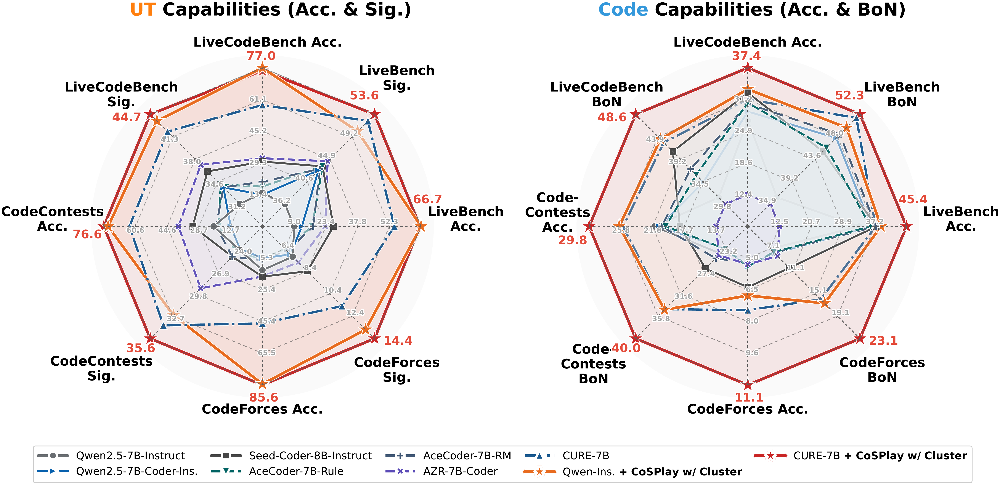
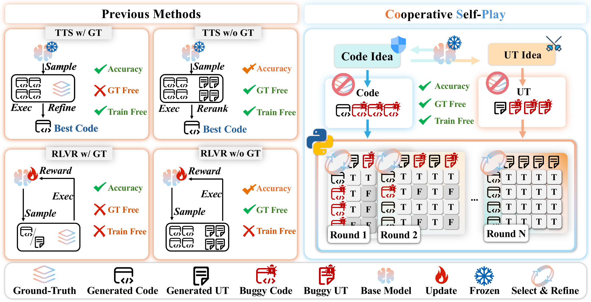
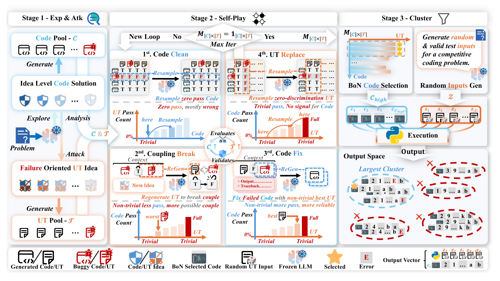
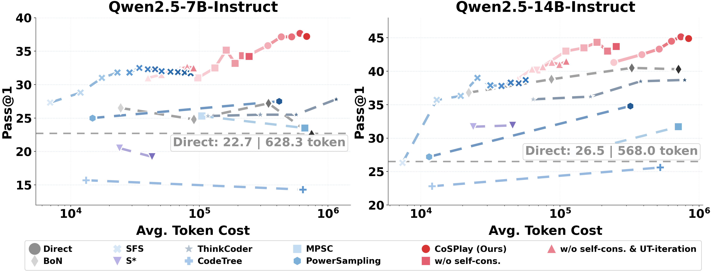
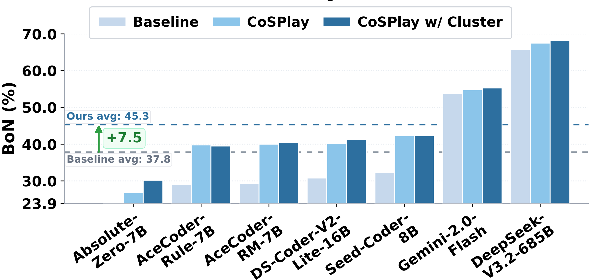
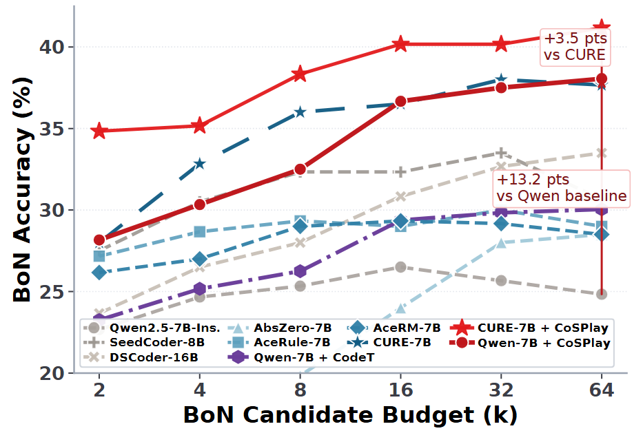
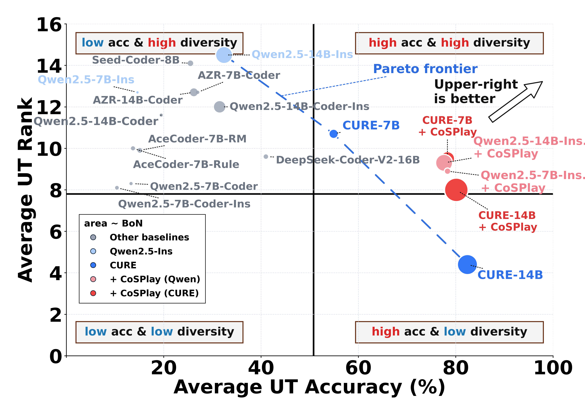

# CoSPlay: Cooperative Self-Play at Test-Time with Self-Generated Code and Unit Test

<p align="center">
  <a href="#-citation"></a>
  <a href="https://github.com/sanae-ai/CosPlay"></a>
  <a href="https://huggingface.co/datasets/yomi017/CosPlay"></a>
  <a href="LICENSE"></a>
</p>


<p align="center">
  📌 <a href="#-introduction">Introduction</a> •
  🎯 <a href="#-motivation">Motivation</a> •
  🧠 <a href="#-methods">Methods</a> •
  ✨ <a href="#-contributions">Contributions</a> •
  🚀 <a href="#-quick-start">Quick Start</a> •
  🛠️ <a href="#-comprehensive-evaluation">Evaluation</a> •
  📊 <a href="#-interesting-results">Results</a> •
  📚 <a href="#-citation">Citation</a>
</p>


<p align="center">
  
</p>


<p align="center">
  <sub><em><strong>Capability Comparison.</strong> Performance comparison between our <b>Training-free</b> and <b>GT-free CoSPlay</b> and other RLVR methods need <b>costly weight updating</b> (AZR-7B-Coder 0k) or <b>massive GT labels</b> (AceCoder-7B-Rule 22k, AceCoder-7B-RM 329k, CURE-7B 4.5k).</em></sub>
</p>


## 📌 Introduction

Unit tests are powerful executable signals for code generation, but strong RLVR or GT-based TTS pipelines often rely on costly ground-truth tests, while GT-free methods struggle with noisy, weak, or spuriously coupled self-generated tests. **CoSPlay** is a **GT-free, training-free** framework that improves code and unit tests together at inference time through exploration-attack-guided idea generation, execution-matrix-driven self-play, and output-consensus clustering for final selection.

The current release provides evaluation code, benchmark loaders, paper figures, and scripts for reproducing the CoSPlay pipeline. Generated data and evaluation logs are hosted on Hugging Face.

## 🎯 Motivation

CoSPlay targets the middle ground between GT-dependent RLVR and sampling-only TTS: high-accuracy code generation with **no GT tests** and **no additional training**.

<p align="center">
  
</p>


<p align="center">
  <sub><em><strong>Motivation.</strong> GT-free and training-free code generation setting.</em></sub>
</p>


Existing RLVR methods can rely on costly ground-truth unit tests and weight updates, while GT-free TTS methods often spend more compute on sampling without reliably filtering noisy self-generated tests.

## 🧠 Methods

CoSPlay treats code generation as a test-time interaction between a code pool and a unit-test pool. The pipeline has three stages: idea-level exploration and attack, execution-matrix-driven self-play, and output-consensus cluster selection.

<p align="center">
  
</p>


<p align="center">
  <sub><em><strong>Full CoSPlay Pipeline.</strong> Exp&Atk idea generation, execution-matrix self-play, and output-consensus clustering.</em></sub>
</p>


CoSPlay first generates solution-oriented code ideas and failure-oriented UT ideas to bootstrap reliable and discriminative pools. It then co-evolves code and UTs through execution-matrix pass-count signals, and resolves BoN ties with output-consensus clustering.

## ✨ Contributions

- **GT-free and training-free self-play:** CoSPlay builds a cooperative loop between self-generated code and self-generated unit tests, improving inference-time performance without ground-truth unit tests or model weight updates.
- **Execution-matrix signals:** Code and unit-test pass counts provide internal reliability signals, allowing the method to clean weak code, refresh noisy tests, repair useful failures, and co-evolve both pools.
- **Consensus-based final selection:** Output-consensus clustering resolves BoN ties using random valid inputs, improving robustness, scaling behavior, and transfer across base models.

## 🚀 Quick Start

### ⚙️ Setup Environment

Clone the repository:

```bash
git clone https://github.com/sanae-ai/CosPlay.git
cd CosPlay
```

Create an environment and install dependencies:

```bash
bash setup_env.sh
```

The script initializes `conda` correctly for non-interactive bash, creates the `CosPlay` environment, and installs the CUDA-sensitive packages one step at a time. If your GPU, driver, or CUDA wheel stack differs from CUDA 12.8, override the relevant variables before running it, for example `TORCH_INDEX_URL`, `VLLM_WHEEL_URL`, `VLLM_EXTRA_INDEX_URL`, or `MAX_JOBS`.

### ⬇️ Download Dataset

We provide the benchmark datasets used by CoSPlay on Hugging Face. The download script writes JSON files to `CURE_data/`, which is where the evaluation scripts expect to find them.

#### Small Dataset Shards

These are the small split files used by the default evaluation scripts. Use this option for normal reproduction and quick checks.

```bash
python data/download_data.py
```

List available small shards:

```bash
python data/download_data.py --list
```

Download selected shards only:

```bash
python data/download_data.py --dataset LiveBench_chunk_0 CodeForces_chunk_0
```

#### Four Full Benchmark Datasets

These are the four complete benchmark files: `CodeContests.json`, `CodeForces.json`, `LiveBench.json`, and `LiveCodeBench.json`. They are much larger than the small shards, so download them only for full-dataset reprocessing.

```bash
python data/download_data.py --group full
```

List available full benchmark files:

```bash
python data/download_data.py --group full --list
```

Generated data, benchmark datasets, and evaluation logs are hosted at [[Hugging Face]](https://huggingface.co/datasets/yomi017/CosPlay).

## 🔥 Run

Run the default evaluation entrypoint:

```bash
CONDA_ENV_NAME=cosplay bash evaluation/eval.sh
```

## 📊 Main Results

<p align="center">
  
</p>


<p align="center">
  <sub><em><strong>Efficiency.</strong> Token cost versus Pass@1 on Qwen2.5-Instruct models.</em></sub>
</p>


Darker markers indicate scaled variants with larger budgets; CoSPlay reaches a stronger cost-accuracy trade-off than GT-free TTS baselines.

---

<p align="center">
  
</p>


<p align="center">
  <sub><em><strong>Generalization.</strong> BoN gains across base and RL models.</em></sub>
</p>


CoSPlay generalizes across different model families and scales, showing that the self-play mechanism is not tied to a single checkpoint.

---

<p align="center">
  
</p>


<p align="center">
  <sub><em><strong>Scaling.</strong> BoN accuracy versus candidate-pool budget.</em></sub>
</p>


CoSPlay continues to scale with larger candidate-pool budgets, improving the BoN accuracy ceiling beyond strong baselines.

---

<p align="center">
  
</p>


<p align="center">
  <sub><em><strong>UT Diversity Trade-off.</strong> UT accuracy-rank frontier with BoN and Signal encoded by marker size.</em></sub>
</p>


CoSPlay improves the accuracy-diversity frontier, indicating that better self-generated tests can help select stronger and more diverse code candidates.

## 📚 Citation

If you use CoSPlay, please cite the paper:

```bibtex
@article{hu2026cosplay,
  title={CoSPlay: Cooperative Self-Play at Test-Time with Self-Generated Code and Unit Test},
  author={Hu, Zhangyi and Liu, Chenhui and Huang, Tian and Li, Jindong and Yang, Yang and Wu, Jiemin and Zhong, Zining and Yang, Menglin and Yue, Yutao},
  journal={arXiv preprint},
  year={2026}
}
```

## 🌻 Acknowledgement

This work was supported in part by Guangzhou-HKUST(GZ) Joint Funding Program (Grant No. 2023A03J0008), Education Bureau of Guangzhou Municipality.

## 📜 License

This project is released under the [MIT License](LICENSE).

## 📬 Contact

For questions, please contact zhangyi_hu@whu.edu.cn, cliu9168@gmail.com, or yfield017@gmail.com.
