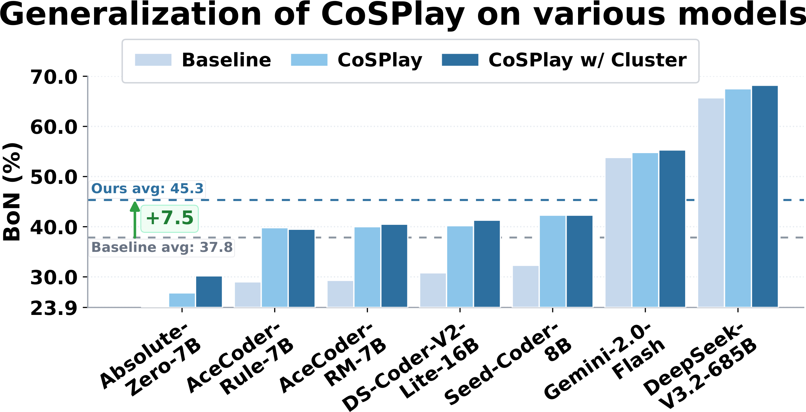
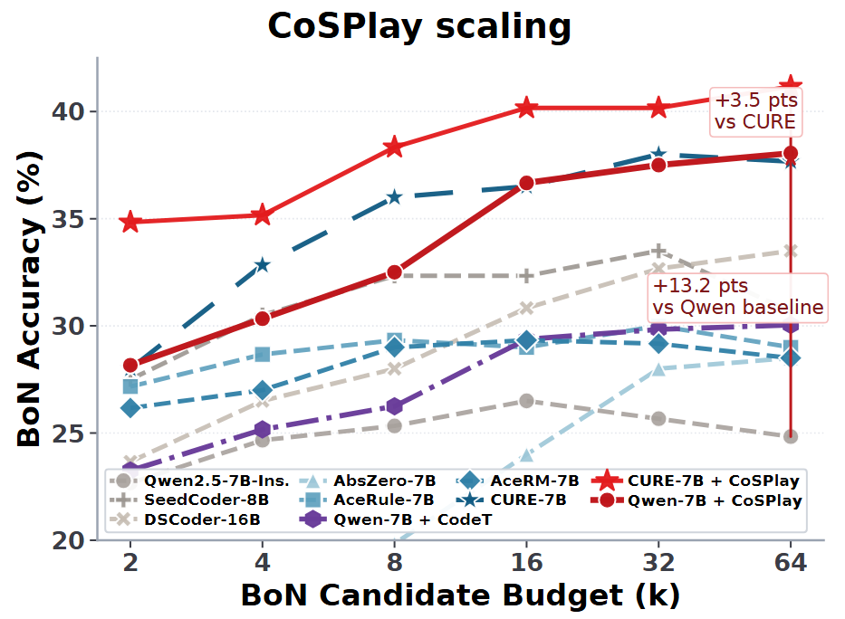

# CoSPlay: Cooperative Self-Play at Test-Time with Self-Generated Code and Unit Test

<p align="center">
  <a href="#-citation"></a>
  <a href="https://github.com/sanae-ai/CosPlay"></a>
  <a href="https://huggingface.co/datasets/yomi017/CosPlay"></a>
  <a href="LICENSE"></a>
</p>

<p align="center">
  📌 <a href="#-introduction">Introduction</a> •
  🎯 <a href="#-motivation">Motivation</a> •
  🧠 <a href="#-methods">Methods</a> •
  ✨ <a href="#-contributions">Contributions</a> •
  🚀 <a href="#-quick-start">Quick Start</a> •
  📦 <a href="#-data-and-logs">Data & Logs</a> •
  🛠️ <a href="#-comprehensive-evaluation">Evaluation</a> •
  📊 <a href="#-interesting-results">Results</a> •
  📚 <a href="#-citation">Citation</a>
</p>

## 📌 Introduction

CoSPlay is a **GT-free, training-free test-time scaling (TTS)** framework for code generation. It improves a chosen base model at inference time by coupling self-generated code and unit tests through cooperative self-play, without requiring ground-truth unit tests or releasing a separately trained model.

The current release provides evaluation code, benchmark loaders, paper figures, and scripts for reproducing the CoSPlay pipeline. Generated data and evaluation logs are hosted on Hugging Face.

<p align="center">
  
</p>

<p align="center">
  <em><strong>Capability Comparison.</strong> Performance comparison between our training-free and GT-free CoSPlay and other RLVR methods, which require costly weight updating or massive GT labels.</em>
</p>

<p align="center">
  
</p>

<p align="center">
  <em><strong>Efficiency.</strong> Token cost versus Pass@1 of TTS methods and CoSPlay on Qwen2.5-Instruct models. For each method, darker markers indicate its scaled variant with a larger budget.</em>
</p>

## 🔥 Latest Updates

- **2026-05**: Code, evaluation scripts, generated data, and logs are being prepared for public release.
- **TODO**: Add the paper link after the paper page is available.

## 🎯 Motivation

Existing RLVR methods can rely on costly ground-truth unit tests and weight updates, while GT-free TTS methods often spend more compute on sampling without reliably filtering noisy self-generated tests. CoSPlay targets the middle ground: high-accuracy code generation with **no GT tests** and **no additional training**.

<p align="center">
  
</p>

<p align="center">
  <em><strong>Motivation.</strong> Achieving high accuracy without any GT data and additional training.</em>
</p>

## 🧠 Methods

CoSPlay treats code generation as a test-time interaction between a code pool and a unit-test pool. The pipeline has three stages: idea-level exploration and attack, execution-matrix-driven self-play, and output-consensus cluster selection.

1. **Explore** candidate code ideas and failure-oriented unit-test ideas.
2. **Generate** code candidates and adversarial/random unit tests.
3. **Self-play** between code and tests to clean weak code, replace weak tests, and fix useful failures.
4. **Cluster** output behavior using random valid test inputs.
5. **Select** the final answer with BoN-style code selection.

<p align="center">
  
</p>

<p align="center">
  <em><strong>Method Overview.</strong> Given a coding problem, CoSPlay first generates solution-oriented code ideas and failure-oriented UT ideas to bootstrap self-play with reliable and discriminative codes and UTs. It then builds a Code-UT execution matrix, whose pass-count statistics provide internal bidirectional filtering signals for code cleaning, coupled UT-code breaking, code repairing, refreshing, and co-evolving both pools. Finally, it resolves BoN ties by output-consensus clustering on randomly generated inputs, selecting codes that are most functionally consistent.</em>
</p>

## ✨ Contributions

- **GT-free and training-free self-play:** CoSPlay builds a cooperative loop between self-generated code and self-generated unit tests, improving inference-time performance without ground-truth unit tests or model weight updates.
- **Execution-matrix signals:** Code and unit-test pass counts provide internal reliability signals, allowing the method to clean weak code, refresh noisy tests, repair useful failures, and co-evolve both pools.
- **Consensus-based final selection:** Output-consensus clustering resolves BoN ties using random valid inputs, improving robustness, scaling behavior, and transfer across base models.

## 🚀 Quick Start

Clone the repository:

```bash
git clone https://github.com/sanae-ai/CosPlay.git
cd CosPlay
```

Create an environment:

```bash
conda create -n cosplay python=3.10
conda activate cosplay
```

Install the expected runtime packages:

```bash
pip install torch transformers vllm openai numpy termcolor jinja2
```

Depending on your CUDA, PyTorch, vLLM, and cluster setup, you may need to install these packages from the official wheels for your platform.

## 📦 Data and Logs

This repository does **not** release trained models. CoSPlay is a TTS method that can be applied to a selected base model at evaluation time.

Generated data and evaluation logs are available here:

```text
https://huggingface.co/datasets/yomi017/CosPlay
```

The main benchmark trends are summarized above; complete generated data and logs are released separately to keep this repository lightweight.

## 🧩 Benchmarks

CoSPlay evaluates on four coding benchmarks:

| Benchmark | Description |
| --- | --- |
| CodeContests | Algorithmic programming problems from the CodeContests benchmark. |
| CodeForces | Codeforces-style competitive-programming problems. |
| LiveBench | Recent coding problems from LiveBench. |
| LiveCodeBench | Recent competitive-programming style problems from LiveCodeBench. |

Evaluation files are placed under `CURE_data/`, and the provided script handles the released dataset files automatically.

## 🛠️ Comprehensive Evaluation

Run the default open-source evaluation entrypoint:

```bash
CONDA_ENV_NAME=cosplay bash evaluation/eval.sh
```

Evaluate a base model by local path or model ID:

```bash
MODEL=/path/to/model bash evaluation/eval.sh
MODEL=Qwen/Qwen2.5-7B-Instruct bash evaluation/eval.sh
```

Run repeated experiments with separate output modes:

```bash
REPEAT_IDS=1,2,3 bash evaluation/eval.sh
```

Override GPU placement:

```bash
CUDA_VISIBLE_DEVICES=0,1 GPU_GROUPS='[[0],[1]]' bash evaluation/eval.sh
```

Common runtime overrides:

| Variable | Meaning |
| --- | --- |
| `PYTHON_BIN` | Python executable, for example `python3` |
| `CONDA_ENV_NAME` | Optional conda environment to activate |
| `MODEL` | Model name or local checkpoint path |
| `CUDA_VISIBLE_DEVICES` | GPUs visible to the process |
| `GPU_GROUPS` | vLLM engine GPU grouping |
| `REPEAT_IDS` | Comma-separated repeated run suffixes |
| `LOG_ROOT` | Output directory for evaluation logs |

Logs are written under `CURE_logs/final_eval_logs/final/Cosplay_7b/` by default.

The default configuration in `evaluation/eval.sh` is the final CoSPlay setting used by this repository:

| Setting | Default |
| --- | --- |
| Code candidates | `K_CODE=16` |
| Unit-test candidates | `K_CASE=16` |
| Self-play rounds | `SELF_PLAY_ROUND=5` |
| Evaluation mode | `bon` |
| Default base model | `Qwen/Qwen2.5-7B-Instruct` |

## 📊 Interesting Results

CoSPlay also generalizes across different model families and scales, showing that the self-play mechanism is not tied to a single checkpoint.

<p align="center">
  
</p>

<p align="center">
  <em><strong>Generalization.</strong> CoSPlay improves diverse base and RL models, showing that the cooperative self-play mechanism is complementary to stronger pretrained or post-trained checkpoints.</em>
</p>

CoSPlay continues to scale with larger candidate-pool budgets, improving the BoN accuracy ceiling beyond strong baselines.

<p align="center">
  
</p>

<p align="center">
  <em><strong>Scaling.</strong> Scalability of CoSPlay with candidate-pool size. CoSPlay reaches higher BoN accuracy as the candidate budget grows and remains above strong baseline models.</em>
</p>

CoSPlay improves the accuracy-diversity frontier, indicating that better self-generated tests can help select stronger and more diverse code candidates.

<p align="center">
  
</p>

<p align="center">
  <em><strong>UT Diversity Trade-off.</strong> CoSPlay improves UT accuracy with slightly decreased yet competitive rank; larger markers indicate higher BoN and Signal scores, showing that this improved trade-off translates into stronger final selection capability.</em>
</p>

## 🗂️ Repository Layout

```text
CosPlay/
  assets/         Paper figures and README preview images
  CURE_data/      Benchmark JSON files used by the evaluator
  evaluation/     Generation, execution, metrics, prompts, and eval script
  LICENSE         MIT license
  README.md       Project overview and usage notes
```

Key evaluation files:

| File | Purpose |
| --- | --- |
| `evaluation/eval.sh` | Main evaluation entrypoint |
| `evaluation/main.py` | Argument parsing and end-to-end evaluation orchestration |
| `evaluation/generator.py` | Candidate code and unit-test generation pipeline |
| `evaluation/self_play.py` | Self-play refinement loop |
| `evaluation/execution.py` | Code execution and test running |
| `evaluation/metrics.py` | Metric computation and logging |

## 📚 Citation

If you use CoSPlay, please cite the paper:

```bibtex
@article{hu2026cosplay,
  title={CoSPlay: Cooperative Self-Play at Test-Time with Self-Generated Code and Unit Test},
  author={Hu, Zhangyi and Liu, Chenhui and Huang, Tian and Li, Jindong and Yang, Yang and Wu, Jiemin and Zhong, Zining and Yang, Menglin and Yue, Yutao},
  journal={arXiv preprint},
  year={2026}
}
```

## 🌻 Acknowledgement

This work was supported in part by Guangzhou-HKUST(GZ) Joint Funding Program (Grant No. 2023A03J0008), Education Bureau of Guangzhou Municipality.

## 📜 License

This project is released under the [MIT License](LICENSE).

## 📬 Contact

TODO.
